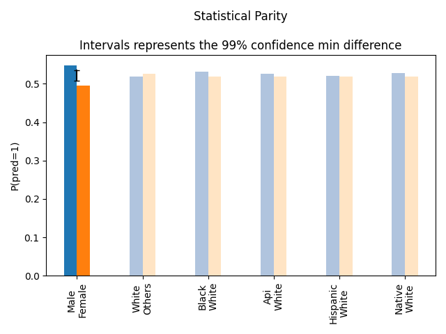
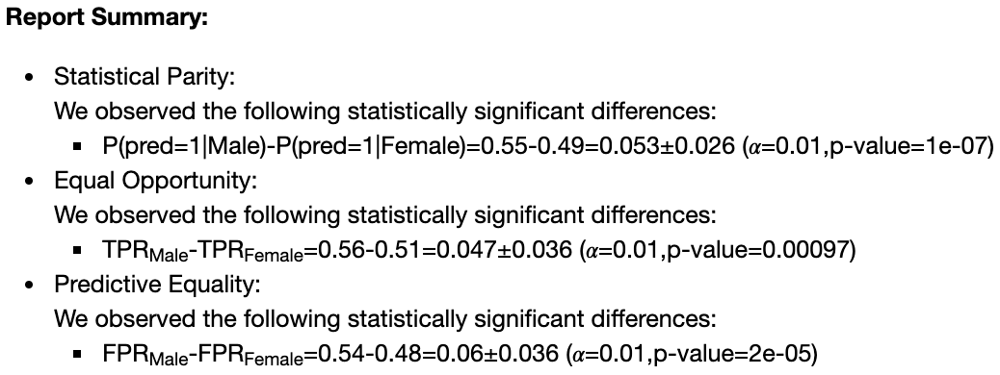
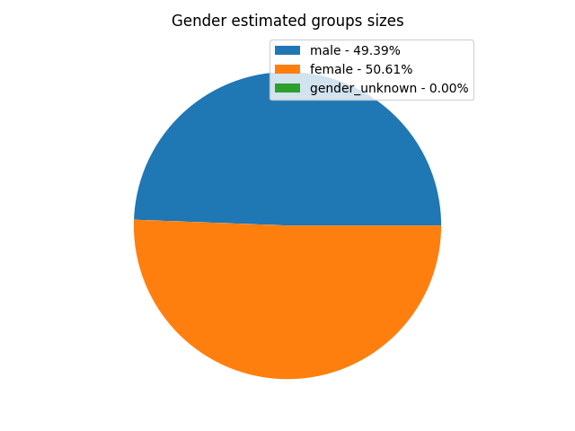
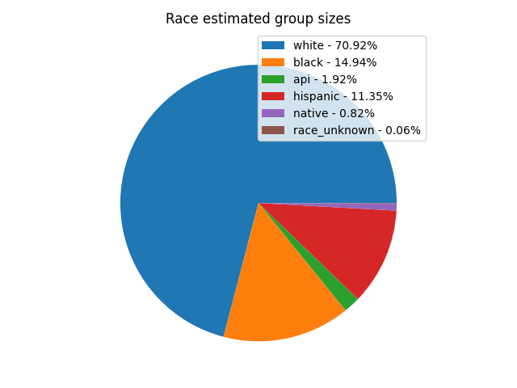

[](https://codecov.io/gh/intuit/bias-detector)
[](https://circleci.com/gh/intuit/bias-detector)

#  Bias Detector
[//]: # (description)
Bias detector is a python package for detecting bias in machine learning models used for making high stakes decisions.

Based on email address/first and last name/zip code the package analyzes the probability of the user belonging to different genders/races. Then, the model predictions per gender/race are compared using various bias metrics.

Using this package the data scientist would be able to get insight on whether their model is biased or not.

The Bias Detector developers can be contacted on Stack Overflow using the bias-detector tag. 
We would appreciate your feedback!

### Supported Metrics
There are many metrics which can possibly be used to detect Bias, we currently support the following three:
1. Statistical Parity - tests whether the probability of 2 groups to be classified as belonging to the positive class by the model is equal.
2. Equal Opportunity - tests whether the True Positive Rates of 2 groups are equal (how likely is the model to predict correctly the positive class for each group).
2. Predictive Equality - tests whether there False Positive Rates of 2 groups are equal (how likely is the model to predict incorrectly the positive class for each group).

### Usage

**Install the package**

```
!pip install bias-detector
```

**Calculate bias metrics based on users data, y_true and y_pred:** 

```
from bias_detector.BiasDetector import BiasDetector
bias_report = BiasDetector().get_bias_report(first_names=first_names, last_names=last_names, zip_codes=zip_codes, y_true=y_true, y_pred=y_pred, country='US')
bias_report.plot_summary()
bias_report.print_summary()
```

**Example for the report output:** 

bias_report contains:
- plot_summary function to visualize the results.
- print_summary function to summarize the results.
- plot_groups function to visualize the estimated groups distribution.

<p float="left" width="80%">
    
    
</p>
<p float="left" width="80%">
  
  
</p>

### Contributing

See [CONTRIBUTING.md](CONTRIBUTING.md)

### References 
1. NINAREH MEHRABI, FRED MORSTATTER, NRIPSUTA SAXENA, KRISTINA LERMAN, and ARAM GALSTYAN, 2019. A Survey on Bias and Fairness in Machine Learning.
2. Moritz Hardt, Eric Price, Nathan Srebro, 2016. Equality of Opportunity in Supervised Learning.
3. Ioan Voicu (2018) Using First Name Information to Improve Race and Ethnicity Classification, Statistics and Public Policy, 5:1, 1-13, DOI: 10.1080/2330443X.2018.1427012

